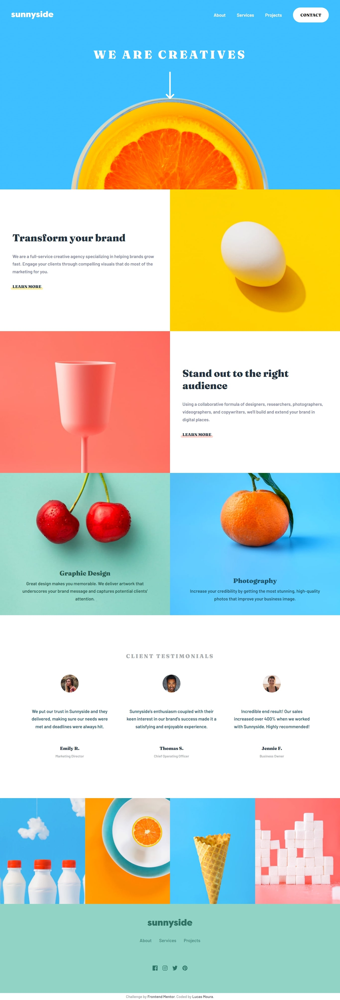

# Sunnyside agency landing page

This is a solution to the [Sunnyside agency landing page challenge on Frontend Mentor](https://www.frontendmentor.io/challenges/sunnyside-agency-landing-page-7yVs3B6ef).

## Table of contents

- [Overview](#overview)
  - [The challenge](#the-challenge)
  - [Screenshot](#screenshot)
  - [Links](#links)
- [My process](#my-process)
  - [Built with](#built-with)
- [Author](#author)

## Overview

### The challenge

Users should be able to:

- View the optimal layout for the site depending on their device's screen size
- See hover states for all interactive elements on the page

### Screenshot

### Links

- Solution URL: [Solution Page](https://your-solution-url.com)
- Live Site URL: [Sunnyside agency landing page](https://lucasdemouramacedo.github.io/landing-page-sunnyside-agency/)

## My process

### Built with

- Semantic HTML5 markup
- CSS custom properties
- Flexbox
- Mobile-first workflow
- [Sass](https://sass-lang.com/) - For styles

## Author

**- Website - [Add your name here](https://www.your-site.com)**
- Frontend Mentor - [@lucasdemouramacedo](https://www.frontendmentor.io/profile/lucasdemouramacedo)
- Instagram - [@lucasmouramacedo](https://www.instagram.com/lucasmouramacedo)